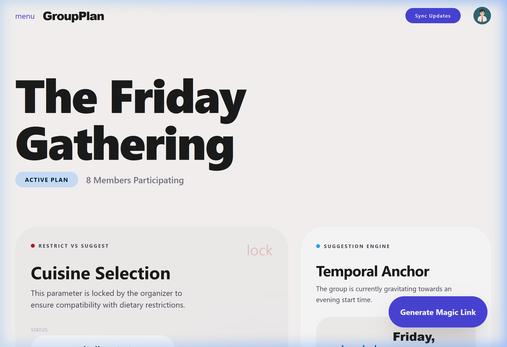

# GroupPlan



AI-powered group restaurant planning. Hosts create beautiful shareable invitations, guests submit preferences, and Claude proposes real nearby venues the whole group will love. The group votes using Borda count scoring; the host finalizes with one click and everyone gets a calendar invite.

## How it works

1. Host creates an event, sets a location and RSVP deadline, and sends invitation links
2. Guests RSVP and submit dietary restrictions, cuisine preferences, budget range, and vibe
3. Host triggers AI synthesis — Claude searches real nearby venues via Google Places and ranks them against every guest's preferences, returning 3–10 proposals
4. Guests rank proposals; Borda count tallies votes in real time
5. Host picks the winner (or sets a vote deadline for auto-finalize), confirms the time, and GroupPlan sends a `winner-announced` email with a `.ics` calendar attachment to every accepted guest

## Tech stack

| Layer | Technology |
|---|---|
| Frontend | Next.js 14 (App Router) |
| Database / Auth | Supabase (PostgreSQL + RLS + Realtime) |
| AI synthesis | Claude Haiku (`claude-haiku-4-5-20251001`, Anthropic) |
| Venue search | Google Places API v1 (Yelp Fusion as fallback) |
| Email | SendGrid |
| Hosting | AWS Amplify |

## Project structure

```
groupplan/
├── apps/
│   └── web/                    # Next.js 14 app
│       ├── app/
│       │   ├── (auth)/         # Login + magic-link verify pages
│       │   ├── (host)/         # Dashboard, event management, results
│       │   ├── api/            # Route handlers (events, invites, votes, calendar…)
│       │   ├── e/[slug]/       # Public event status page
│       │   └── invite/[token]/ # Guest RSVP, preferences, and voting pages
│       ├── components/
│       │   ├── forms/          # EventCreateForm, AITriggerButton, FinalizeFlow
│       │   ├── host/           # UsageBadge, ThemeToggle
│       │   ├── voting/         # VotingInterface (live Borda tally)
│       │   └── realtime/       # GuestStatusList (Supabase realtime)
│       └── lib/
│           ├── auto-finalize.ts   # Check-on-read auto-finalize logic
│           ├── calendar.ts        # ICS calendar export
│           ├── email.ts           # SendGrid email rendering + sending
│           ├── env.ts             # Force-loads .env.local (Windows shadow workaround)
│           ├── notifications.ts   # sendBatch() helper + email service factory
│           ├── photo-signing.ts   # HMAC-SHA256 photo proxy token signing
│           ├── rate-limit.ts      # In-memory sliding-window rate limiter
│           ├── scoring.ts         # bordaScore(), computeBorda(), DINNER_DURATION_MS
│           └── status-ui.ts       # STATUS_COLORS and STATUS_LABELS constants
├── packages/
│   ├── types/        # Shared TypeScript types + Zod schemas
│   ├── db/           # Supabase client + typed query helpers
│   ├── ai/           # AI provider interface + Claude adapter
│   └── venues/       # Venue provider interface + Google Places / Yelp adapters
└── supabase/
    ├── migrations/   # PostgreSQL schema migrations (run in order)
    └── setup.sql     # Full schema for fresh installs
```

Business logic, API types, and adapters live in `packages/` so a future React Native app can import them without duplicating code.

## Getting started

### Prerequisites

- Node.js ≥ 20
- pnpm ≥ 9
- A [Supabase](https://supabase.com) project

### 1. Clone and install

```bash
git clone https://github.com/andersonmcalpine/groupplan.git
cd groupplan
pnpm install
```

### 2. Configure environment

```bash
cp .env.example apps/web/.env.local
```

Fill in all values in `apps/web/.env.local`. Required keys are listed below.

### 3. Set up the database

In the Supabase dashboard **SQL editor**, paste and run `supabase/setup.sql` for a fresh install.

If you already have the base schema and are migrating, run each file in `supabase/migrations/` in numerical order:

```
001_enums.sql
002_tables.sql
003_rls.sql
004_indexes.sql
005_relax_rank_checks.sql
006_usage_log.sql
007_vote_deadline.sql
008_replace_proposals_rpc.sql
```

### 4. Run the dev server

```bash
pnpm dev
```

App runs at [http://localhost:3000](http://localhost:3000). The interactive demo is at `/` (no login required). The host dashboard is at `/dashboard`.

## Environment variables

| Variable | Required | Description |
|---|---|---|
| `NEXT_PUBLIC_SUPABASE_URL` | ✓ | Supabase project URL |
| `NEXT_PUBLIC_SUPABASE_ANON_KEY` | ✓ | Supabase anon key |
| `SUPABASE_SERVICE_ROLE_KEY` | ✓ | Service role key (server-only) |
| `ANTHROPIC_API_KEY` | ✓ | Claude API key |
| `GOOGLE_PLACES_API_KEY` | ✓ | Google Places API v1 key |
| `YELP_API_KEY` | — | Fallback if Google Places is unavailable |
| `SENDGRID_API_KEY` | — | Email notifications (skipped if absent) |
| `SENDGRID_FROM_EMAIL` | — | Sender address (required if SendGrid key set) |
| `SENDGRID_FROM_NAME` | — | Sender display name (defaults to `GroupPlan`) |
| `NEXT_PUBLIC_APP_URL` | — | Full origin for email links (defaults to `http://localhost:3000`) |
| `PHOTO_PROXY_SECRET` | — | HMAC secret for photo proxy tokens (derived from service role key if absent) |

## Key features

### AI synthesis
- Searches up to 20 real nearby venues via Google Places (Yelp fallback)
- Claude reads all guest preferences and ranks venues into 3–10 proposals
- Each proposal includes reasoning, constraints met/missed, and a suggested time
- AI and venue search spend logged to `usage_log`; shown in the host UI via `UsageBadge`
- Demo endpoint (`/api/demo/synthesize`) rate-limited to 3 runs/hour per IP

### Voting
- Guests rank proposals using a numbered rank selector
- Borda count scoring: with N proposals, rank-1 = N pts, rank-N = 1 pt
- Live tally polled every 4 s while the guest is on the voting page
- Re-ranking safe: tally polling is paused during in-flight submissions to prevent race conditions
- Host can re-run AI synthesis from the deciding state (two-click confirm that wipes existing votes)

### Vote deadline & auto-finalize
- Optional `vote_deadline` field on events; set at creation time or left null for manual control
- On any read of the results, tally, or event page, `maybeAutoFinalize()` checks whether the deadline has passed and, if so, locks in the current Borda winner, inserts a `finalized_plans` row, and sends winner emails — all idempotently

### Email notifications
- All three send sites (invite, trigger, finalize) use `sendBatch()` for consistent error logging
- Individual failures logged to `console.error` with recipient email and message
- API responses include `{ emails: { sent, failed } }` so the host UI can surface bounce counts

### Photo proxy
- Google Places photo URLs contain the API key; they are never sent to the browser
- Server-side proxy at `/api/demo/photo` accepts HMAC-SHA256 signed tokens with a 24-hour TTL
- Tokens sign `<ref>.<expiry>`; expired or tampered tokens return 403

### Dark mode
- Toggled via the sun/moon button in the host header
- State persisted to `localStorage.gp_tweaks.darkMode`
- Synchronous `<script>` in `<head>` applies `html[data-theme="dark"]` before first paint to eliminate flash
- CSS responds to either `html[data-theme="dark"]` or `body.dark`

### Public status page (`/e/[slug]`)
- Shows live guest RSVP status via Supabase realtime
- After finalization, shows a venue card: name, cuisine, address, confirmed time, and an "Open in Maps" button

### Calendar export
- `.ics` download at `/api/events/[id]/calendar`
- Accessible without auth (guests click from their email)
- Times emitted as UTC with `Z` suffix (`startInputType: 'utc'`) so every calendar app interprets them correctly
- Includes `PRODID`, `STATUS:CONFIRMED`, and all accepted guests as attendees

## Security notes

- All host-scoped API routes verify `event.host_id === user.id` before mutating (defense-in-depth on top of RLS)
- Vote endpoint verifies the invite token belongs to the correct event and that the event is in `deciding` state
- Service client (`SUPABASE_SERVICE_ROLE_KEY`) is only used in server-only paths that require bypassing RLS (auto-finalize, calendar download, tally)

## Shared utilities reference

| File | Exports |
|---|---|
| `apps/web/lib/scoring.ts` | `bordaScore`, `computeBorda`, `DINNER_DURATION_MS` |
| `apps/web/lib/status-ui.ts` | `STATUS_COLORS`, `STATUS_LABELS` |
| `apps/web/lib/email.ts` | `sendEmail`, `renderEmail`, `EmailTemplate` |
| `apps/web/lib/calendar.ts` | `IcsCalendarExporter` |
| `apps/web/lib/notifications.ts` | `getNotificationService`, `sendBatch`, `appUrl` |
| `apps/web/lib/env.ts` | `ensureEnvLoaded` — force-loads `.env.local` on Windows where system env vars can shadow it |
| `apps/web/lib/auto-finalize.ts` | `maybeAutoFinalize` |
| `apps/web/lib/photo-signing.ts` | `signPhotoRef`, `verifyPhotoRef` |
| `apps/web/lib/rate-limit.ts` | `rateLimit`, `clientIp` |

## Contributing

This project uses [Conventional Commits](https://www.conventionalcommits.org/). Each PR should be focused and include a clear description of the change and why it was made.

## License

MIT
