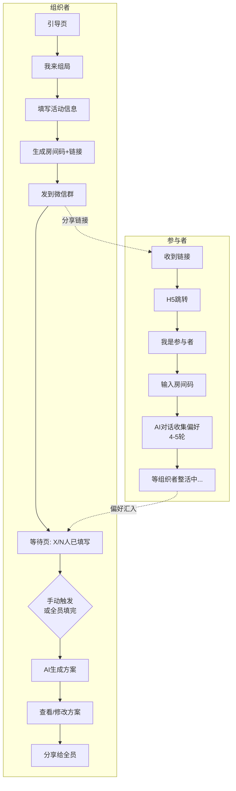

# 今天整点啥 · PRD v0\.1

# 产品一句话定位

用 AI 替代"群里那个最操心的人"——自动收集所有人偏好，生成一份大家都说得过去的一站式聚会方案，支持动态修改。

---

# 基本信息

|**产品名称**|今天整点啥（What's the Plan）|
|---|---|
|**Slogan**|少废话，直接出发|
|**Logo 方向**|一只叼着薯条/行程单的海鸥，配气泡问"今天整点薯条？"|
|**视觉调性**|橙\+白撞色，圆润粗体，卡片式布局，高饱和，带互联网梗文案|
|**目标平台**|Web App（H5，支持微信内打开跳转）|
|**版本范围**|P1 核心功能（黑客松演示版）|

---

# 一、产品背景与目标

## 问题陈述

熟人聚会（朋友、家人、同事小团）的最大痛点不是"没地方玩"，而是：

- 群里问一圈没人出主意，最后不了了之

- 每个人喜好不同，协调成本极高

- 有人出了方案，又反复被改，组织者心力交瘁

## 产品目标

用 AI 替代"群里那个最操心的人"，自动收集所有人偏好，生成一份大家都说得过去的一站式聚会方案，支持动态修改。

## 成功指标（演示版）

- 

    * [ ] 能完整走通"创建聚会 → 成员填偏好 → 生成方案 → 修改方案"全流程

- 

    * [ ] 方案输出包含商家推荐（调用真实 API）

- 

    * [ ] 文案风格俏皮，有辨识度

---

# 二、用户角色

## 组织者

发起聚会的人，负责创建活动、分享链接

**核心诉求：**省心，不想一直催人、问人

## 参与者

被邀请填偏好的成员

**核心诉求：**快，3 分钟内搞定，不被烦死

---

# 三、用户旅程

## 3\.1 组织者旅程

## 3\.2 参与者旅程

## 3\.3 AI 偏好收集对话流程（参与者侧，4\-5 轮）

|轮次|AI 问法风格|收集维度|备注|
|---|---|---|---|
|第 1 轮|"这次聚会你最想要啥感觉？给我一个词或一句话都行"|活动大类/氛围倾向|开放式，降低门槛|
|第 2 轮|"吃的方面有啥雷区吗？（比如不吃辣、素食、海鲜过敏之类的）"|饮食硬性禁忌|用"雷区"比"忌口"更自然|
|第 3 轮|"人均花多少你会觉得值？① 随便，钱不是问题 ② 100\-200 刚刚好 ③ 50 以内，穷鬼联盟"|预算|给选项，避免用户思考|
|第 4 轮|"你在哪？方便我给你算顺路的方案"（调起定位或手动选地铁站）|出发位置|影响路线规划|
|第 5 轮（可选）|"有没有特别不想干的事？（比如：不想唱歌、怕高、讨厌密闭空间）"|活动硬性排除|如用户前面已透露则跳过|

**兜底规则：**任何问题用户回答"随便/都行"，AI 自动填默认值，不追问。

---

# 四、核心功能模块

## 4\.1 创建聚会（组织者）

**输入字段**

- 活动名称（可选，默认"\[组织者名\]的聚会"）

- 活动日期 / 时间段（白天/晚上/全天）

- 预计人数

- 活动区域（默认深圳南山区，演示版固定）

**输出**

- 6 位房间码

- 专属 H5 链接（支持微信内打开）

- 二维码（可选）

## 4\.2 偏好收集（参与者）

- 每个参与者独立完成 AI 对话，数据存入该房间的偏好池

- 组织者可在等待页实时看到"X/N 人已填写"

- 支持组织者手动触发生成（不必等所有人填完）

## 4\.3 偏好融合算法

**规则优先级：**

1. 硬性禁忌优先过滤（饮食过敏、明确排除的活动类型）

2. 偏好冲突 → 加权多数：多数人偏好作为主推，少数人偏好在方案中标注兼顾方式

3. 预算 → 取中位数，并在结果中说明

4. 输出主方案 \+ 方案 B：主方案满足多数，方案 B 满足折中/少数

## 4\.4 方案生成与展示

**方案输出示例：**

🎪 今天整点啥 · 本期聚会方案

经过对 X 位社恐/社牛的深度审讯，AI 替你们做完了所有选择题 🫡

📅 第一站 \[时间\] \| \[商家名\] · \[品类\]

📍 地址 · 距 XX 地铁站 X 分钟 ⭐ 招牌：XXX（评分 X\.X）

💬 为什么选这里：命中了 XX 的「不想出汗」\+ XX 的「想吃好的」

📅 第二站 \[时间\] \| \[商家名\] · \[品类\]

⚠️ 特别标注：XX 不吃辣，已为他备注可点清汤锅，孤独但体面

💰 人均预算：约 XXX 元 \| 🗺️ 全程打车约 XX 元 / 步行可达

🅱️ 方案 B：\[备选方案简述\]

🎟️ 商家联动优惠券 · 即将上线

**动态修改：**

- 结果页底部有对话输入框

- 用户可说"把第一站换成户外"、"预算再降一点"

- AI 理解意图，定向替换对应模块，其余保留

## 4\.5 商家数据（演示版）

|数据源|说明|
|---|---|
|主数据源|高德地图 / 腾讯地图 POI API（实时查询周边商家，含评分、地址、品类）|
|兜底数据|人工整理深圳南山区 20\-30 家代表性商家 JSON（API 异常时启用）|
|覆盖品类|餐饮（火锅/烧烤/日料/西餐）、娱乐（桌游/密室/KTV）、户外（公园/滨海）|

---

# 五、页面清单（P1）

|页面|路径|说明|
|---|---|---|
|引导页|/|海鸥 logo \+ slogan \+ "开整"按钮|
|身份选择|/join|我来组局 / 我是参与者|
|创建聚会|/create|填写活动基本信息|
|邀请页|/invite/:roomId|展示房间码、链接、二维码|
|等待页|/waiting/:roomId|组织者视角，查看填写进度|
|偏好对话|/chat/:roomId|参与者与 AI 对话收集偏好|
|填写完成|/done|参与者填完后的等待页|
|方案展示|/result/:roomId|生成的聚会方案 \+ 修改入口|

---

# 六、范围外（本次不做）

- 用户账号体系 / 登录注册

- 历史记录 / 方案收藏

- 真实优惠券发放

- 多城市支持

- 地图/动线可视化

---

# 七、风险与应对

|风险|应对|
|---|---|
|高德 API 现场调用失败|启用兜底 JSON 数据|
|参与者不填偏好|组织者可手动触发生成，缺失字段用默认值|
|AI 生成方案质量差|Prompt 中内置南山区地标、品类知识，限制输出格式|
|微信跳转 H5 受限|备用方案：直接发房间码，用户手动输入|

> (注：内容由 AI 生成，请谨慎参考）
